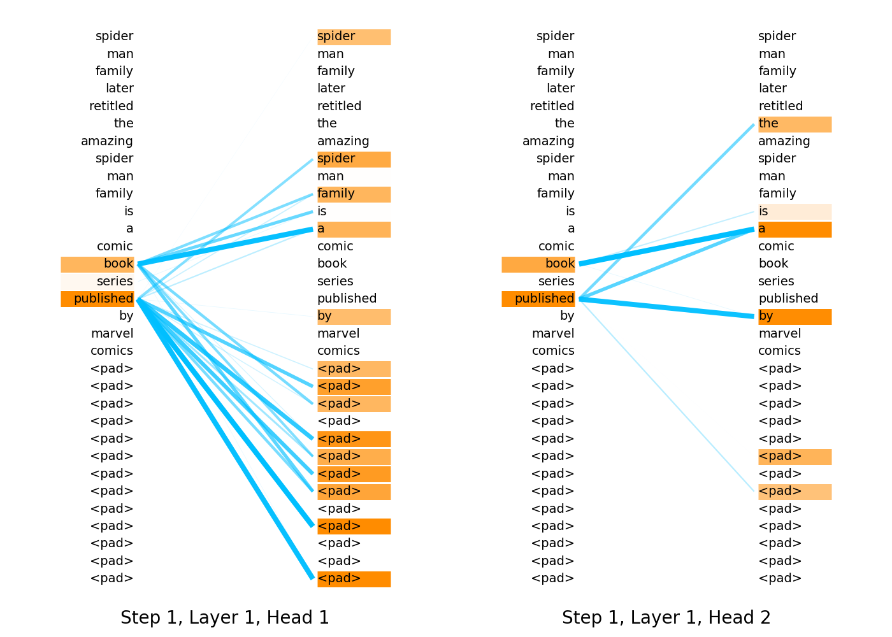
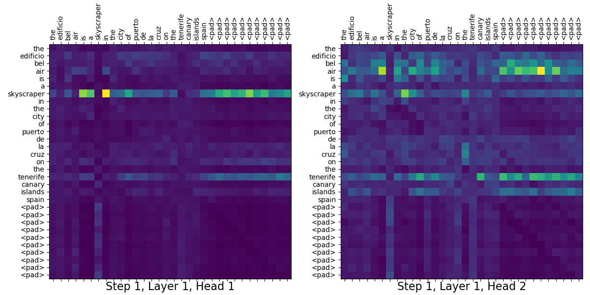

# Text classification using CapsNet and multihead relative attention with Keras + tensorflow

This repository contains the code that allows to train a network 
on [DBpedia dataset](https://github.com/le-scientifique/torchDatasets/raw/master/dbpedia_csv.tar.gz) 
for the classic NLP task of text classification. The model includes two different mechanisms 
stacked together - CapsNet encoder and encoder with MultiHead Relative Attention, which could be 
used both separately and jointly to obtain better results. 

---
This project is the part of a datascience portfolio. Other projects can be found here:
* [Implementation of progressive groving of GANs with Keras + tensorflow](https://github.com/plotnikov938/pg-gans-keras-tf)
* [Implementation of PPO algorithm for reinforcement learning with Keras + tensorflow](https://github.com/plotnikov938/ppo-keras-tf)
---

## Table of Contents
  * [Installation](#installation)
  * [Training](#training)
  * [Usage](#usage)
  * [Results](#results)
  * [Resources](#resources) 
  * [Contacts](#contacts)   
  
## Installation
Make sure you use Python 3.

Clone this repo to your local machine:
```
$ git clone https://github.com/plotnikov938/txt-class-keras-tf.git
```
Download the [DBpedia dataset](https://github.com/le-scientifique/torchDatasets/raw/master/dbpedia_csv.tar.gz) 
and extract `dbpedia_csv.tar.gz` into the `txt-class-keras-tf/dbpedia_csv` folder.

Go into the project directory:
```
$ cd txt-class-keras-tf/
```
Create a virtual environment if needed:
```
$ python3 -m venv env
```
Use the package manager pip to install requirements:
```
$ pip3 install -r requirements.txt
```

## Training   
Once the dataset are set up, you can proceed to train your own networks.
Edit [config.py](config.py) to specify the base configuration or create a new config.py in the desire location.

Run the training script. For instance, if new config.py were created under the name `config_new.py`, run:
```
$ python3 train.py --path-config /config_new.py
```
The weights for the configured model will be written to the newly created subdirectory as `./weights/classifier.h5` 
    
## Usage
To simply classify text with the already trained model, run:
```
$ python3 run.py --text "__your__text__here__"
```
If you want to show attention weights as a graph/heatmap during classification for some steps, layers 
and heads (depends on the configuration of the model), run:
```
$ python3 run.py --text "__your__text__here__" --show --plot graph --plot-steps 0 --plot-layers 0, 1 --plot-heads 0, 1, 2
```
In order to save attention weights as an image, run:
```
$ python3 run.py --text "__your__text__here__" --plot heatmap --save_plot attn_weights.png
```
There is also available interactive mode when the classifier runs in a loop 
and you have to type new text every iteration. This mode is useful because model weights are loaded only once at program startup:
```
$ python3 run.py --interactive --show --plot heatmap --save_plot attn_weights.png
```

## Results
```
$ python3 run.py --interactive --show --plot graph --save_plot
```

<pre><samp>Input text: Spider-Man Family (later retitled The Amazing Spider-Man Family) is a comic book series published by Marvel Comics 
Predicted text label: WrittenWork</samp></pre>

<p align="center">
    
</p>

```
$ python3 run.py --interactive --show --plot heatmap --save_plot
```

<pre><samp>Input text: The Edificio Bel Air is a skyscraper in the city of Puerto de la Cruz on the Tenerife Canary Islands Spain
Predicted text label: Building</samp></pre>

<p align="center">
    
</p>

## Resources

1. [Matrix Capsules with EM Routing](https://openreview.net/forum?id=HJWLfGWRb)
2. [Dynamic Routing Between Capsules](https://arxiv.org/abs/1710.09829)
3. [Attention Is All You Need](https://arxiv.org/abs/1706.03762)
4. [Self-Attention with Relative Position Representations](https://arxiv.org/abs/1803.02155)
5. [Music Transformer](https://arxiv.org/abs/1809.04281)

## Contacts
Please feel free to contact me if you have any questions:  [plotnikov.ilia938@gmail.com](mailto:plotnikov.ilia938@gmail.com)

